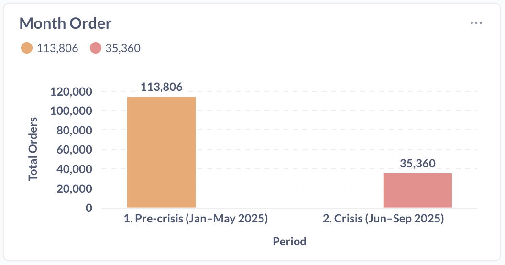
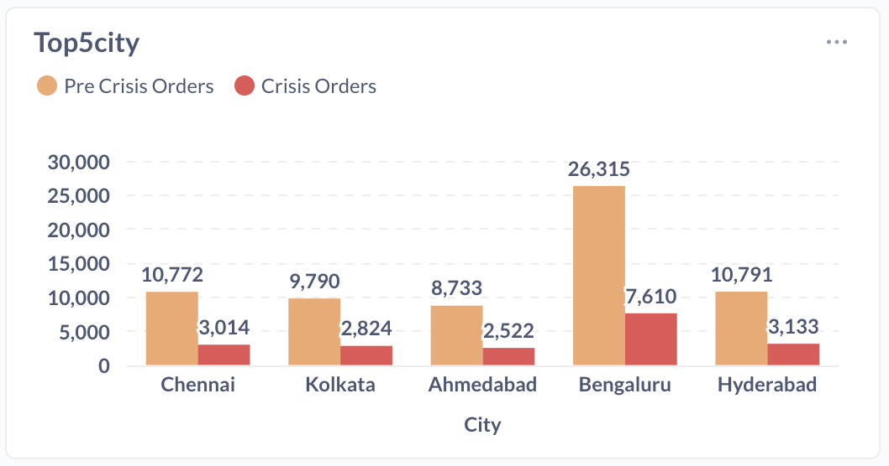
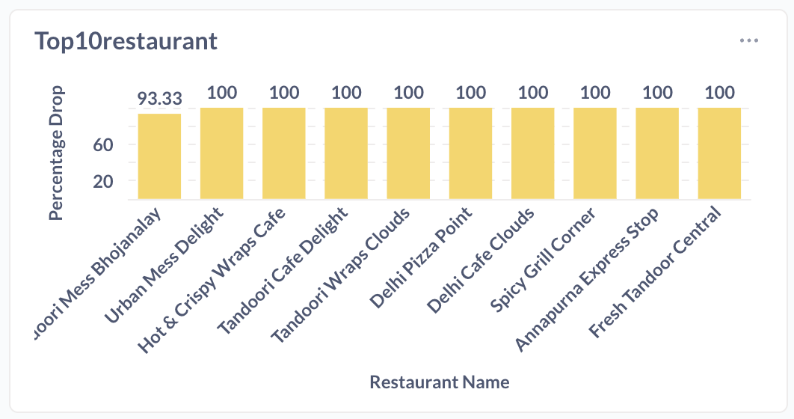
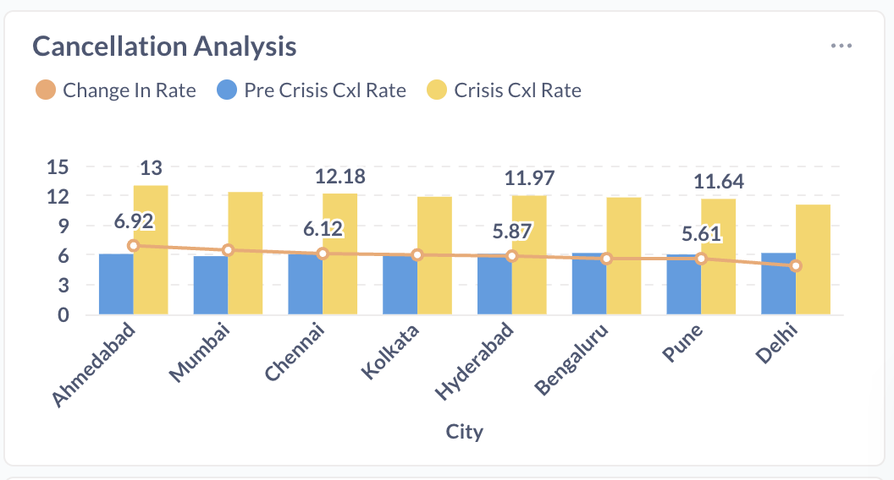
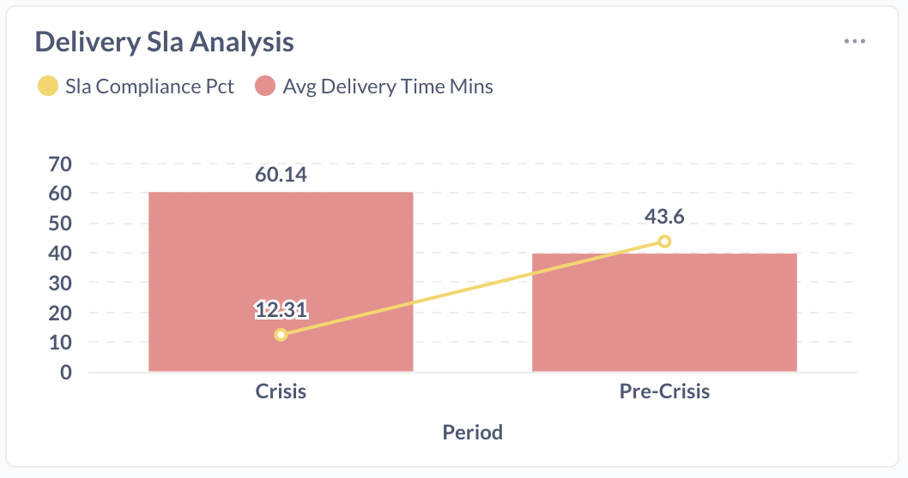
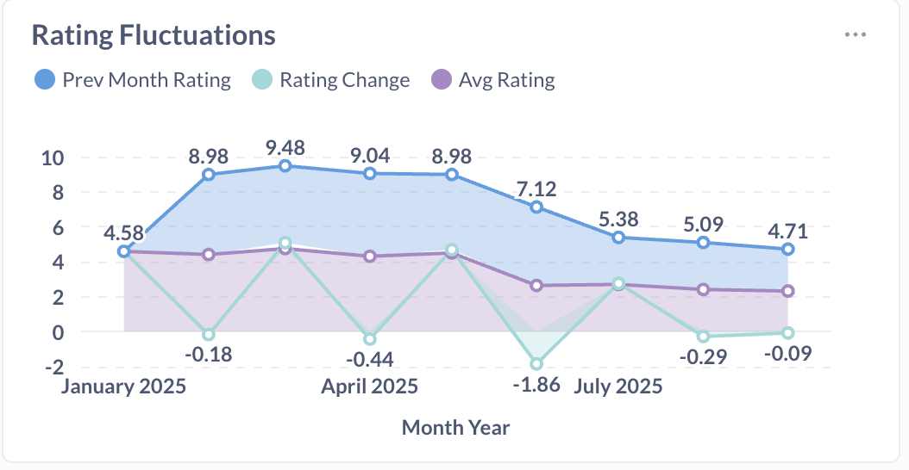
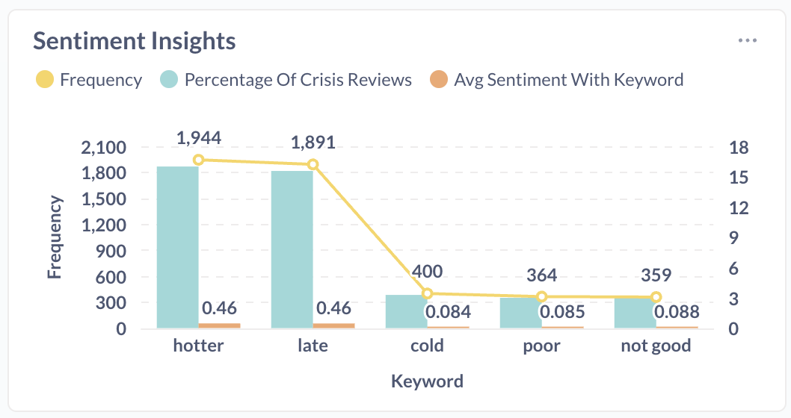
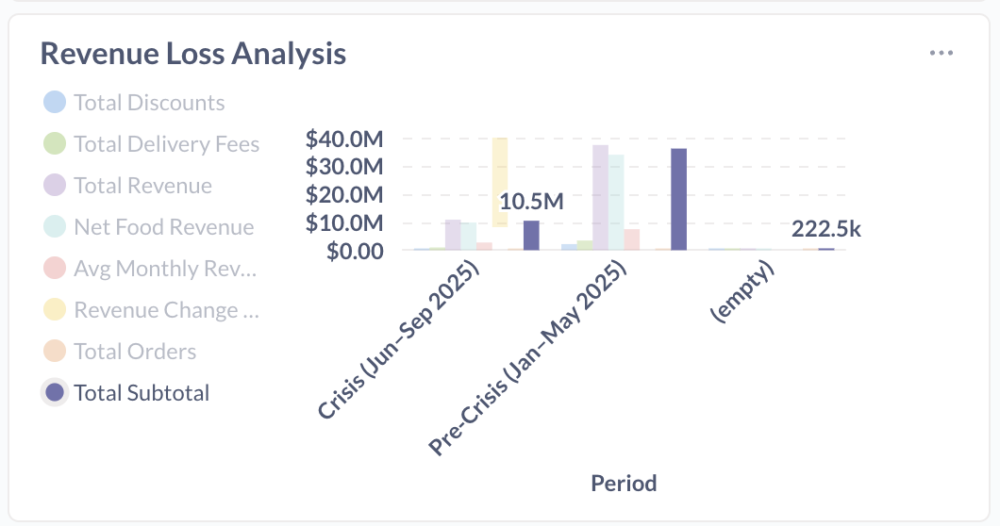
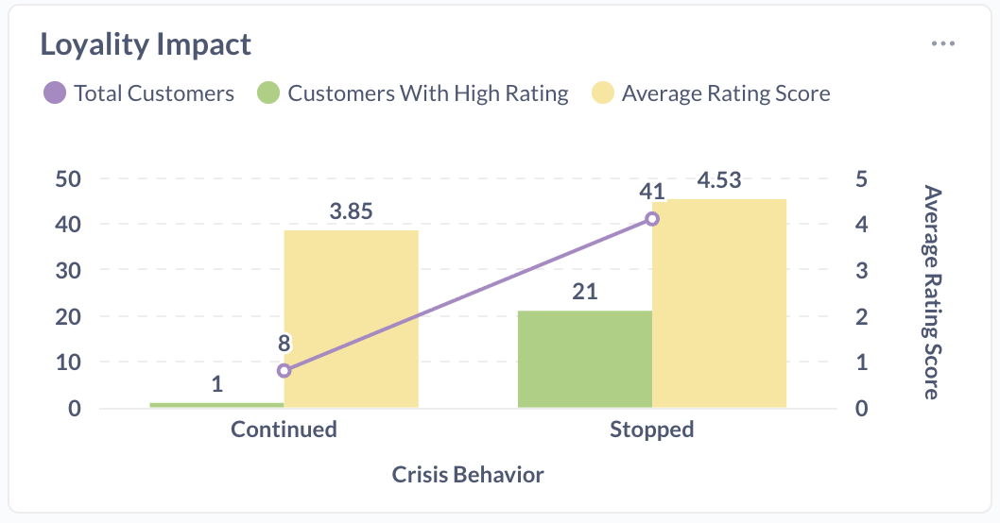
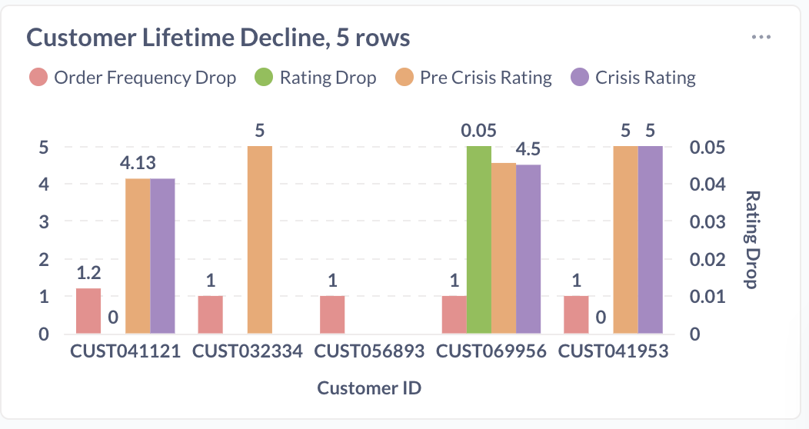

## Query analysis
 
#### 📉 1. Demand Collapse — The First Red Flag
```
The monthly orders graph revealed the most striking insight:
✅ Pre-crisis orders: 113,111
❌ Crisis-period orders: 35,085
📉 A drop of 78,026 orders
This wasn’t just a decline — it was a crisis signal.
```



```sql
SELECT
    CASE
        WHEN order_timestamp BETWEEN '2025-01-01' AND '2025-06-01' THEN '1. Pre-Crisis (Jan–May 2025)'
        WHEN order_timestamp BETWEEN '2025-06-01' AND '2025-10-01' THEN '2. Crisis (Jun–Sep 2025)'
    END AS period,
    COUNT(*) AS total_orders
FROM fact_orders
WHERE order_timestamp BETWEEN '2025-01-01' AND '2025-09-30'
GROUP BY period
ORDER BY period;
```

#### 🏙️ 2. Cities Most Affected
```
The top 5 cities with the highest percentage decline were:
Chennai, Kolkata, Ahmedabad, Bengaluru, and Hyderabad
Drops ranged from –70% to –72%, indicating widespread customer pullback.
They rank among the top 10 cities in India for order volumes and active users. The negative feedback affect this area as most of the population are young professional and highly educated who prefer to read reviews before ordering food. 
```

```sql
WITH city_period_orders AS (
    SELECT d.city,
        CASE
            WHEN f.order_timestamp >= '2025-01-01' AND f.order_timestamp <= '2025-05-31' THEN 'Pre-Crisis'
            WHEN f.order_timestamp >= '2025-06-01' AND f.order_timestamp <= '2025-09-30' THEN 'Crisis'
            ELSE NULL
        END AS period,
        count(*) AS total_orders
        FROM fact_orders f
        JOIN dim_restaurant d ON f.restaurant_id = d.restaurant_id
        WHERE f.order_timestamp >= '2025-01-01' AND f.order_timestamp <= '2025-09-30' AND f.is_cancelled = 'N'::bpchar
        GROUP BY d.city, (
            CASE
                WHEN f.order_timestamp >= '2025-01-01' AND f.order_timestamp <= '2025-05-31' THEN 'Pre-Crisis'
                WHEN f.order_timestamp >= '2025-06-01' AND f.order_timestamp <= '2025-09-30' THEN 'Crisis'
                ELSE NULL
            END)
    ), city_comparison AS (
        SELECT pre.city,
            COALESCE(pre.total_orders, 0::bigint) AS pre_crisis_orders,
            COALESCE(crisis.total_orders, 0::bigint) AS crisis_orders,
                CASE
                    WHEN pre.total_orders > 0 THEN round((crisis.total_orders - pre.total_orders)::numeric * 100.0 / pre.total_orders::numeric, 2)
                    ELSE NULL::numeric
                END AS pct_change
        FROM city_period_orders pre
        LEFT JOIN city_period_orders crisis ON pre.city = crisis.city AND crisis.period = 'Crisis'
        WHERE pre.period = 'Pre-Crisis'
    )
SELECT city_comparison.city,
    city_comparison.pre_crisis_orders,
    city_comparison.crisis_orders,
    city_comparison.pct_change
FROM city_comparison
WHERE city_comparison.pct_change IS NOT NULL
ORDER BY city_comparison.pct_change
LIMIT 5;
```


#### 🍽️ 3. High-Performing Restaurants Hit Hard
```
Top restaurants like:
•	Tandoori Mess Bhojnalaya
•	Urban Mess Delight
•	Hot & Crispy
•	Tandoori Wraps Clouds
•	Delhi café,
•	spicy grill corner
•	Annapurna express stop
•	Fresh tandoor
All showed the highest percentage drop in orders.
Even strong brands couldn’t avoid the downturn.
```

```sql
WITH
    restaurant_order_volumes AS (
        SELECT
            fo.restaurant_id,
            dr.restaurant_name,
            dr.city,
            count(
                CASE
                    WHEN fo.order_timestamp >= '2025-01-01'
                    AND fo.order_timestamp <= '2025-05-31' THEN 1
                    ELSE NULL
                END
            ) AS pre_crisis_orders,
            count(
                CASE
                    WHEN fo.order_timestamp >= '2025-06-01'
                    AND fo.order_timestamp <= '2025-09-30' THEN 1
                    ELSE NULL
                END
            ) AS crisis_orders
        FROM
            fact_orders fo
            JOIN dim_restaurant dr ON fo.restaurant_id = dr.restaurant_id
        WHERE
            fo.order_timestamp >= '2025-01-01'
            AND fo.order_timestamp <= '2025-09-30'
            AND fo.is_cancelled = 'N'
        GROUP BY
            fo.restaurant_id,
            dr.restaurant_name,
            dr.city
        HAVING
            count(
                CASE
                    WHEN fo.order_timestamp >= '2025-01-01'
                    AND fo.order_timestamp <= '2025-05-31' THEN 1
                    ELSE NULL
                END
            ) > 0
    ),
    top_pre_crisis_restaurants AS (
        SELECT
            restaurant_order_volumes.restaurant_id,
            restaurant_order_volumes.restaurant_name,
            restaurant_order_volumes.city,
            restaurant_order_volumes.pre_crisis_orders,
            restaurant_order_volumes.crisis_orders,
            row_number() OVER (
                ORDER BY
                    restaurant_order_volumes.pre_crisis_orders DESC
            ) AS pre_crisis_rank
        FROM
            restaurant_order_volumes
    ),
    percentage_drops AS (
        SELECT
            top_pre_crisis_restaurants.restaurant_id,
            top_pre_crisis_restaurants.restaurant_name,
            top_pre_crisis_restaurants.city,
            top_pre_crisis_restaurants.pre_crisis_orders,
            top_pre_crisis_restaurants.crisis_orders,
            top_pre_crisis_restaurants.pre_crisis_rank,
            round(
                (
                    top_pre_crisis_restaurants.pre_crisis_orders - top_pre_crisis_restaurants.crisis_orders
                ) * 100.0 / NULLIF(top_pre_crisis_restaurants.pre_crisis_orders, 0),
                2
            ) AS percentage_drop,
            round(
                top_pre_crisis_restaurants.crisis_orders * 100.0 / NULLIF(top_pre_crisis_restaurants.pre_crisis_orders, 0),
                2
            ) AS crisis_vs_pre_crisis_pct
        FROM
            top_pre_crisis_restaurants
        WHERE
            top_pre_crisis_restaurants.pre_crisis_rank <= 50
    )
SELECT
    percentage_drops.restaurant_id,
    percentage_drops.restaurant_name,
    percentage_drops.city,
    percentage_drops.pre_crisis_orders,
    percentage_drops.crisis_orders,
    percentage_drops.percentage_drop,
    percentage_drops.crisis_vs_pre_crisis_pct,
    percentage_drops.pre_crisis_rank
FROM
    percentage_drops
WHERE
    percentage_drops.percentage_drop > 0
ORDER BY
    percentage_drops.percentage_drop DESC
LIMIT
    10;
```


#### ❌ 4. Cancellation Spike — Early Sign of Customer Frustration
```
Cities such as Ahmedabad, Mumbai, Chennai, Kolkata, and Hyderabad experienced the largest rise in cancellations.
This aligned closely with operational delays.
```

```sql
WITH
    city_period_stats AS (
        SELECT
            d.city,
            CASE
                WHEN f.order_timestamp >= '2025-01-01'
                AND f.order_timestamp <= '2025-05-31' THEN 'Pre-Crisis'
                WHEN f.order_timestamp >= '2025-06-01'
                AND f.order_timestamp <= '2025-09-30' THEN 'Crisis'
                ELSE NULL
            END AS period,
            count(*) AS total_orders,
            sum(
                CASE
                    WHEN f.is_cancelled = 'Y' THEN 1
                    ELSE 0
                END
            ) AS cancelled_orders
        FROM
            fact_orders f
            JOIN dim_restaurant d ON f.restaurant_id = d.restaurant_id
        WHERE
            f.order_timestamp >= '2025-01-01'
            AND f.order_timestamp <= '2025-09-30'
        GROUP BY
            d.city,
            (
                CASE
                    WHEN f.order_timestamp >= '2025-01-01'
                    AND f.order_timestamp <= '2025-05-31' THEN 'Pre-Crisis'
                    WHEN f.order_timestamp >= '2025-06-01'
                    AND f.order_timestamp <= '2025-09-30' THEN 'Crisis'
                    ELSE NULL
                END
            )
    ),
    pivoted AS (
        SELECT
            city_period_stats.city,
            round(
                sum(
                    CASE
                        WHEN city_period_stats.period = 'Pre-Crisis' THEN city_period_stats.cancelled_orders
                        ELSE NULL
                    END
                ) * 100.0 / NULLIF(
                    sum(
                        CASE
                            WHEN city_period_stats.period = 'Pre-Crisis' THEN city_period_stats.total_orders
                            ELSE NULL
                        END
                    ),
                    0
                ),
                2
            ) AS pre_crisis_cxl_rate,
            round(
                sum(
                    CASE
                        WHEN city_period_stats.period = 'Crisis' THEN city_period_stats.cancelled_orders
                        ELSE NULL
                    END
                ) * 100.0 / NULLIF(
                    sum(
                        CASE
                            WHEN city_period_stats.period = 'Crisis' THEN city_period_stats.total_orders
                            ELSE NULL
                        END
                    ),
                    0
                ),
                2
            ) AS crisis_cxl_rate
        FROM
            city_period_stats
        GROUP BY
            city_period_stats.city
    )
SELECT
    pivoted.city,
    pivoted.pre_crisis_cxl_rate,
    pivoted.crisis_cxl_rate,
    round(
        pivoted.crisis_cxl_rate - pivoted.pre_crisis_cxl_rate,
        2
    ) AS change_in_rate
FROM
    pivoted
ORDER BY
    (
        round(
            pivoted.crisis_cxl_rate - pivoted.pre_crisis_cxl_rate,
            2
        )
    ) DESC;
```

 
#### 🚚 5. Delivery SLA Worsened
```
Delivery times increased significantly — a major trigger for customer churn in food delivery.
When delivery breaks, trust breaks.
```

```sql
WITH
    delivery_phases AS (
        SELECT
            fdp.order_id,
            fdp.actual_delivery_time_mins,
            fdp.expected_delivery_time_mins,
            fo.order_timestamp,
            CASE
                WHEN fo.order_timestamp >= '2025-01-01'
                AND fo.order_timestamp <= '2025-05-31' THEN 'Pre-Crisis'
                WHEN fo.order_timestamp >= '2025-06-01'
                AND fo.order_timestamp <= '2025-09-30' THEN 'Crisis'
                ELSE NULL
            END AS period,
            CASE
                WHEN fdp.actual_delivery_time_mins <= fdp.expected_delivery_time_mins THEN 1
                ELSE 0
            END AS sla_met
        FROM
            fact_delivery_performance fdp
            JOIN fact_orders fo ON fdp.order_id = fo.order_id
        WHERE
            fo.order_timestamp >= '2025-01-01'
            AND fo.order_timestamp <= '2025-09-30'
            AND fo.is_cancelled = 'N'
    ),
    period_stats AS (
        SELECT
            delivery_phases.period,
            count(*) AS total_deliveries,
            sum(delivery_phases.sla_met) AS on_time_deliveries,
            avg(delivery_phases.actual_delivery_time_mins) AS avg_delivery_time,
            avg(delivery_phases.sla_met) * 100 AS sla_compliance_rate
        FROM
            delivery_phases
        WHERE
            delivery_phases.period IS NOT NULL
        GROUP BY
            delivery_phases.period
    )
SELECT
    period_stats.period,
    period_stats.total_deliveries,
    period_stats.on_time_deliveries,
    period_stats.avg_delivery_time (10, 2) AS avg_delivery_time_mins,
    period_stats.sla_compliance_rate (10, 2) AS sla_compliance_pct
FROM
    period_stats
ORDER BY
    period_stats.period;
```

#### ⭐ 6. Rating Drop — Especially in June 2025
```
June recorded the biggest fall in ratings: –1.86.that was the start of crisis period and it was the peak of customer dissatisfaction.
```

```sql
 WITH clean_data AS (
         SELECT fact_ratings.review_timestamp,
                CASE
                    WHEN fact_ratings.rating::text ~ '^[0-9]+\.?[0-9]*$'::text THEN fact_ratings.rating::numeric
                    ELSE NULL::numeric
                END AS rating_num
           FROM fact_ratings
          WHERE fact_ratings.review_timestamp IS NOT NULL AND fact_ratings.rating IS NOT NULL AND fact_ratings.rating::text <> ''::text
        ), monthly_ratings AS (
         SELECT EXTRACT(year FROM to_date(clean_data.review_timestamp, 'DD-MM-YYYY'::text)) AS year_val,
            EXTRACT(month FROM to_date(clean_data.review_timestamp, 'DD-MM-YYYY'::text)) AS month_val,
            round(avg(clean_data.rating_num), 2) AS avg_rating,
            count(*) AS total_reviews
           FROM clean_data
          WHERE clean_data.rating_num IS NOT NULL
          GROUP BY (EXTRACT(year FROM to_date(clean_data.review_timestamp, 'DD-MM-YYYY'::text))), (EXTRACT(month FROM to_date(clean_data.review_timestamp, 'DD-MM-YYYY'::text)))
          ORDER BY (EXTRACT(year FROM to_date(clean_data.review_timestamp, 'DD-MM-YYYY'::text))), (EXTRACT(month FROM to_date(clean_data.review_timestamp, 'DD-MM-YYYY'::text)))
        )
 SELECT (monthly_ratings.year_val || '-'::text) || lpad(monthly_ratings.month_val::text, 2, '0'::text) AS month_year,
    monthly_ratings.avg_rating,
    monthly_ratings.total_reviews,
    lag(monthly_ratings.avg_rating) OVER (ORDER BY monthly_ratings.year_val, monthly_ratings.month_val) AS prev_month_rating,
    round(monthly_ratings.avg_rating - lag(monthly_ratings.avg_rating) OVER (ORDER BY monthly_ratings.year_val, monthly_ratings.month_val), 3) AS rating_change
   FROM monthly_ratings
  ORDER BY (round(monthly_ratings.avg_rating - lag(monthly_ratings.avg_rating) OVER (ORDER BY monthly_ratings.year_val, monthly_ratings.month_val), 3));
```
 
#### 💬 7. Sentiment Analysis Findings
```
Most frequently appearing negative words during crisis:
“late”, “cold”, “poor”, “hotter”, “not good”
They pointed clearly to operational inconsistency.
```

```sql
 WITH crisis_reviews AS (
         SELECT fact_ratings.order_id,
            fact_ratings.customer_id,
            fact_ratings.restaurant_id,
            fact_ratings.rating,
            lower(fact_ratings.review_text) AS review_text_lower,
            fact_ratings.review_timestamp,
                CASE
                    WHEN fact_ratings.sentiment_score ~ '^[0-9]+\.?[0-9]*$'::text THEN fact_ratings.sentiment_score::numeric
                    ELSE NULL::numeric
                END AS sentiment_score_num
           FROM fact_ratings
          WHERE fact_ratings.review_timestamp >= '01-06-2025'::text AND fact_ratings.review_timestamp <= '30-09-2025'::text AND fact_ratings.sentiment_score ~ '^[0-9]+\.?[0-9]*$'::text AND fact_ratings.sentiment_score::numeric < 0.6
        ), keyword_counts AS (
         SELECT 'late'::text AS keyword,
            count(*) AS frequency
           FROM crisis_reviews
          WHERE crisis_reviews.review_text_lower ~~ '%late%'::text
        UNION ALL
         SELECT 'cold'::text AS keyword,
            count(*) AS frequency
           FROM crisis_reviews
          WHERE crisis_reviews.review_text_lower ~~ '%cold%'::text
        UNION ALL
         SELECT 'hotter'::text AS keyword,
            count(*) AS frequency
           FROM crisis_reviews
          WHERE crisis_reviews.review_text_lower ~~ '%hotter%'::text
        UNION ALL
         SELECT 'slow'::text AS keyword,
            count(*) AS frequency
           FROM crisis_reviews
          WHERE crisis_reviews.review_text_lower ~~ '%slow%'::text
        UNION ALL
         SELECT 'delayed'::text AS keyword,
            count(*) AS frequency
           FROM crisis_reviews
          WHERE crisis_reviews.review_text_lower ~~ '%delayed%'::text
        UNION ALL
         SELECT 'bad'::text AS keyword,
            count(*) AS frequency
           FROM crisis_reviews
          WHERE crisis_reviews.review_text_lower ~~ '%bad%'::text
        UNION ALL
         SELECT 'terrible'::text AS keyword,
            count(*) AS frequency
           FROM crisis_reviews
          WHERE crisis_reviews.review_text_lower ~~ '%terrible%'::text
        UNION ALL
         SELECT 'awful'::text AS keyword,
            count(*) AS frequency
           FROM crisis_reviews
          WHERE crisis_reviews.review_text_lower ~~ '%awful%'::text
        UNION ALL
         SELECT 'poor'::text AS keyword,
            count(*) AS frequency
           FROM crisis_reviews
          WHERE crisis_reviews.review_text_lower ~~ '%poor%'::text
        UNION ALL
         SELECT 'worst'::text AS keyword,
            count(*) AS frequency
           FROM crisis_reviews
          WHERE crisis_reviews.review_text_lower ~~ '%worst%'::text
        UNION ALL
         SELECT 'disappointing'::text AS keyword,
            count(*) AS frequency
           FROM crisis_reviews
          WHERE crisis_reviews.review_text_lower ~~ '%disappointing%'::text
        UNION ALL
         SELECT 'disappointed'::text AS keyword,
            count(*) AS frequency
           FROM crisis_reviews
          WHERE crisis_reviews.review_text_lower ~~ '%disappointed%'::text
        UNION ALL
         SELECT 'wrong'::text AS keyword,
            count(*) AS frequency
           FROM crisis_reviews
          WHERE crisis_reviews.review_text_lower ~~ '%wrong%'::text
        UNION ALL
         SELECT 'missing'::text AS keyword,
            count(*) AS frequency
           FROM crisis_reviews
          WHERE crisis_reviews.review_text_lower ~~ '%missing%'::text
        UNION ALL
         SELECT 'cancelled'::text AS keyword,
            count(*) AS frequency
           FROM crisis_reviews
          WHERE crisis_reviews.review_text_lower ~~ '%cancelled%'::text
        UNION ALL
         SELECT 'soggy'::text AS keyword,
            count(*) AS frequency
           FROM crisis_reviews
          WHERE crisis_reviews.review_text_lower ~~ '%soggy%'::text
        UNION ALL
         SELECT 'dirty'::text AS keyword,
            count(*) AS frequency
           FROM crisis_reviews
          WHERE crisis_reviews.review_text_lower ~~ '%dirty%'::text
        UNION ALL
         SELECT 'rude'::text AS keyword,
            count(*) AS frequency
           FROM crisis_reviews
          WHERE crisis_reviews.review_text_lower ~~ '%rude%'::text
        UNION ALL
         SELECT 'horrible'::text AS keyword,
            count(*) AS frequency
           FROM crisis_reviews
          WHERE crisis_reviews.review_text_lower ~~ '%horrible%'::text
        UNION ALL
         SELECT 'disgusting'::text AS keyword,
            count(*) AS frequency
           FROM crisis_reviews
          WHERE crisis_reviews.review_text_lower ~~ '%disgusting%'::text
        UNION ALL
         SELECT 'stale'::text AS keyword,
            count(*) AS frequency
           FROM crisis_reviews
          WHERE crisis_reviews.review_text_lower ~~ '%stale%'::text
        UNION ALL
         SELECT 'bland'::text AS keyword,
            count(*) AS frequency
           FROM crisis_reviews
          WHERE crisis_reviews.review_text_lower ~~ '%bland%'::text
        UNION ALL
         SELECT 'not good'::text AS keyword,
            count(*) AS frequency
           FROM crisis_reviews
          WHERE crisis_reviews.review_text_lower ~~ '%not good%'::text
        ), total_crisis_reviews AS (
         SELECT count(*) AS total_reviews
           FROM crisis_reviews
        )
 SELECT kc.keyword,
    kc.frequency,
    round(kc.frequency::numeric * 100.0 / tcr.total_reviews::numeric, 2) AS percentage_of_crisis_reviews,
    ( SELECT round(avg(cr.sentiment_score_num), 3) AS round
           FROM crisis_reviews cr
          WHERE cr.review_text_lower ~~ (('%'::text || kc.keyword) || '%'::text)) AS avg_sentiment_with_keyword
   FROM keyword_counts kc
     CROSS JOIN total_crisis_reviews tcr
  WHERE kc.frequency > 0
  ORDER BY kc.frequency DESC, kc.keyword;
```


#### 💸 8. Revenue Loss
```
Revenue also took a massive hit:
✅ Pre-crisis revenue: ₹43,54,630.09
❌ Crisis revenue: ₹12,44,616.17
A major financial impact due to reduced orders and higher cancellations.
```

```sql
WITH
    period_revenue AS (
        SELECT
            CASE
                WHEN fact_orders.order_timestamp >= '2025-01-01'
                AND fact_orders.order_timestamp <= '2025-05-31' THEN 'Pre-Crisis (Jan–May 2025)'
                WHEN fact_orders.order_timestamp >= '2025-06-01'
                AND fact_orders.order_timestamp <= '2025-09-30' THEN 'Crisis (Jun–Sep 2025)'
                ELSE NULL
            END AS period,
            count(*) AS total_orders,
            round(sum(fact_orders.subtotal_amount), 2) AS total_subtotal,
            round(sum(fact_orders.discount_amount), 2) AS total_discounts,
            round(sum(fact_orders.delivery_fee), 2) AS total_delivery_fees,
            round(sum(fact_orders.total_amount), 2) AS total_revenue,
            round(
                sum(
                    fact_orders.subtotal_amount - fact_orders.discount_amount
                ),
                2
            ) AS net_food_revenue
        FROM
            fact_orders
        WHERE
            fact_orders.order_timestamp >= '2025-01-01'
            AND fact_orders.order_timestamp <= '2025-09-30'
            AND fact_orders.is_cancelled = 'N'
        GROUP BY
            (
                CASE
                    WHEN fact_orders.order_timestamp >= '2025-01-01'
                    AND fact_orders.order_timestamp <= '2025-05-31' THEN 'Pre-Crisis (Jan–May 2025)'
                    WHEN fact_orders.order_timestamp >= '2025-06-01'
                    AND fact_orders.order_timestamp <= '2025-09-30' THEN 'Crisis (Jun–Sep 2025)'
                    ELSE NULL
                END
            )
    ),
    revenue_comparison AS (
        SELECT
            period_revenue.period,
            period_revenue.total_orders,
            period_revenue.total_subtotal,
            period_revenue.total_discounts,
            period_revenue.total_delivery_fees,
            period_revenue.total_revenue,
            period_revenue.net_food_revenue,
            CASE
                WHEN period_revenue.period = 'Pre-Crisis (Jan–May 2025)' THEN round(period_revenue.total_revenue / 5, 2)
                WHEN period_revenue.period = 'Crisis (Jun–Sep 2025)' THEN round(period_revenue.total_revenue / 4, 2)
                ELSE NULL
            END AS avg_monthly_revenue
        FROM
            period_revenue
    )
SELECT
    revenue_comparison.period,
    revenue_comparison.total_orders,
    revenue_comparison.total_subtotal,
    revenue_comparison.total_discounts,
    revenue_comparison.total_delivery_fees,
    revenue_comparison.total_revenue,
    revenue_comparison.net_food_revenue,
    revenue_comparison.avg_monthly_revenue,
    CASE
        WHEN revenue_comparison.period = 'Crisis (Jun–Sep 2025)' THEN round(
            revenue_comparison.avg_monthly_revenue - (
                (
                    SELECT
                        revenue_comparison_1.avg_monthly_revenue
                    FROM
                        revenue_comparison revenue_comparison_1
                    WHERE
                        revenue_comparison_1.period = 'Pre-Crisis (Jan–May 2025)'
                )
            ),
            2
        )
        ELSE NULL
    END AS monthly_revenue_loss,
    CASE
        WHEN revenue_comparison.period = 'Crisis (Jun–Sep 2025)' THEN round(
            (
                revenue_comparison.avg_monthly_revenue - (
                    (
                        SELECT
                            revenue_comparison_1.avg_monthly_revenue
                        FROM
                            revenue_comparison revenue_comparison_1
                        WHERE
                            revenue_comparison_1.period = 'Pre-Crisis (Jan–May 2025)'
                    )
                )
            ) * 100.0 / (
                (
                    SELECT
                        revenue_comparison_1.avg_monthly_revenue
                    FROM
                        revenue_comparison revenue_comparison_1
                    WHERE
                        revenue_comparison_1.period = 'Pre-Crisis (Jan–May 2025)'
                )
            ),
            2
        )
        ELSE NULL
    END AS revenue_change_percent
FROM
    revenue_comparison
ORDER BY
    revenue_comparison.period;
```


#### 🔁 9. Loyalty Impact — Even Happy Customers Left
```
Among customers with 5+ pre-crisis orders:
•	Only 8 continued ordering
•	41 stopped completely
•	21 of the churned customers had ratings above 4.5
This highlights destruction of trust, not dissatisfaction.
```

```sql
 WITH pre_crisis_customers AS (
         SELECT fact_orders.customer_id,
            count(*) AS pre_crisis_orders
           FROM fact_orders
          WHERE fact_orders.order_timestamp >= '2025-01-01 00:00:00'::timestamp without time zone AND fact_orders.order_timestamp <= '2025-05-31 00:00:00'::timestamp without time zone AND fact_orders.is_cancelled = 'N'::bpchar
          GROUP BY fact_orders.customer_id
         HAVING count(*) >= 5
        ), crisis_activity AS (
         SELECT fact_orders.customer_id,
            count(*) AS crisis_orders
           FROM fact_orders
          WHERE fact_orders.order_timestamp >= '2025-06-01 00:00:00'::timestamp without time zone AND fact_orders.order_timestamp <= '2025-09-30 00:00:00'::timestamp without time zone AND fact_orders.is_cancelled = 'N'::bpchar
          GROUP BY fact_orders.customer_id
        ), customer_ratings AS (
         SELECT fact_ratings.customer_id,
            avg(fact_ratings.rating::numeric) AS avg_rating,
            count(*) AS total_ratings
           FROM fact_ratings
          WHERE fact_ratings.rating IS NOT NULL AND fact_ratings.rating::text <> ''::text
          GROUP BY fact_ratings.customer_id
        ), analysis AS (
         SELECT pc.customer_id,
            pc.pre_crisis_orders,
            COALESCE(ca.crisis_orders, 0::bigint) AS crisis_orders,
            cr.avg_rating,
            cr.total_ratings,
                CASE
                    WHEN COALESCE(ca.crisis_orders, 0::bigint) = 0 THEN 'Stopped'::text
                    ELSE 'Continued'::text
                END AS crisis_behavior
           FROM pre_crisis_customers pc
             LEFT JOIN crisis_activity ca ON pc.customer_id::text = ca.customer_id::text
             LEFT JOIN customer_ratings cr ON pc.customer_id::text = cr.customer_id
        )
 SELECT analysis.crisis_behavior,
    count(*) AS total_customers,
    count(
        CASE
            WHEN analysis.avg_rating > 4.5 THEN 1
            ELSE NULL::integer
        END) AS customers_with_high_rating,
    round(avg(analysis.avg_rating), 2) AS average_rating_score
   FROM analysis
  GROUP BY analysis.crisis_behavior
  ORDER BY analysis.crisis_behavior;
```


#### 👤 10. High-Value Customers Also Reduced Activity
```
By looking on the chart CUST041121 had 1.2 as order frequency drop and no rating drop. CUST032334  had 1 as order frequency drop. CUST 056893 had also 1 as order  frequency drop but no rating drop.CUST069956 had 1 order and 0.05 as rating drop.CUST041953 had 1 order drop with 0 rating drop.
Top spenders showed drops in order frequency despite stable ratings.
```

```sql
WITH
    high_value_customers AS (
        SELECT
            fact_orders.customer_id,
            sum(fact_orders.total_amount) AS total_spend,
            count(*) AS order_count
        FROM
            fact_orders
        WHERE
            fact_orders.order_timestamp >= '2025-01-01'
            AND fact_orders.order_timestamp <= '2025-05-31'
            AND fact_orders.is_cancelled = 'N'
        GROUP BY
            fact_orders.customer_id
        HAVING
            sum(fact_orders.total_amount) >= (
                (
                    SELECT
                        percentile_cont(0.95) WITHIN GROUP (
                            ORDER BY
                                (t.customer_spend)
                        ) AS percentile_cont
                    FROM
                        (
                            SELECT
                                sum(fact_orders_1.total_amount) AS customer_spend
                            FROM
                                fact_orders fact_orders_1
                            WHERE
                                fact_orders_1.order_timestamp >= '2025-01-01'
                                AND fact_orders_1.order_timestamp <= '2025-05-31'
                                AND fact_orders_1.is_cancelled = 'N'
                            GROUP BY
                                fact_orders_1.customer_id
                        ) t
                )
            )
    ),
    customer_behavior AS (
        SELECT
            fo.customer_id,
            dc.city,
            count(
                CASE
                    WHEN fo.order_timestamp >= '2025-01-01'
                    AND fo.order_timestamp <= '2025-05-31' THEN 1
                    ELSE NULL
                END
            ) / 5.0 AS pre_crisis_monthly_orders,
            count(
                CASE
                    WHEN fo.order_timestamp >= '2025-06-01'
                    AND fo.order_timestamp <= '2025-09-30' THEN 1
                    ELSE NULL
                END
            ) / 4.0 AS crisis_monthly_orders,
            avg(
                CASE
                    WHEN fr.review_timestamp >= '01-01-2025'
                    AND fr.review_timestamp <= '31-05-2025' THEN fr.rating
                    ELSE NULL
                END
            ) AS pre_crisis_rating,
            avg(
                CASE
                    WHEN fr.review_timestamp >= '01-06-2025'
                    AND fr.review_timestamp <= '30-09-2025' THEN fr.rating
                    ELSE NULL
                END
            ) AS crisis_rating,
            mode () WITHIN GROUP (
                ORDER BY
                    dr.cuisine_type
            ) AS preferred_cuisine,
            avg(
                CASE
                    WHEN fo.order_timestamp >= '2025-06-01'
                    AND fo.order_timestamp <= '2025-09-30' THEN fdp.actual_delivery_time_mins - fdp.expected_delivery_time_mins
                    ELSE NULL
                END
            ) AS avg_delay
        FROM
            fact_orders fo
            JOIN dim_customer dc ON fo.customer_id = dc.customer_id
            JOIN dim_restaurant dr ON fo.restaurant_id = dr.restaurant_id
            LEFT JOIN fact_ratings fr ON fo.order_id = fr.order_id
            LEFT JOIN fact_delivery_performance fdp ON fo.order_id = fdp.order_id
        WHERE
            (
                fo.customer_id IN (
                    SELECT
                        high_value_customers.customer_id
                    FROM
                        high_value_customers
                )
            )
            AND fo.is_cancelled = 'N'
        GROUP BY
            fo.customer_id,
            dc.city
    )
SELECT
    customer_behavior.customer_id,
    customer_behavior.city,
    round(customer_behavior.pre_crisis_monthly_orders, 2) AS pre_crisis_monthly_orders,
    round(customer_behavior.crisis_monthly_orders, 2) AS crisis_monthly_orders,
    round(
        customer_behavior.pre_crisis_monthly_orders - customer_behavior.crisis_monthly_orders,
        2
    ) AS order_frequency_drop,
    round(customer_behavior.pre_crisis_rating, 2) AS pre_crisis_rating,
    round(customer_behavior.crisis_rating, 2) AS crisis_rating,
    round(
        customer_behavior.pre_crisis_rating - customer_behavior.crisis_rating,
        2
    ) AS rating_drop,
    customer_behavior.preferred_cuisine,
    round(customer_behavior.avg_delay, 1) AS avg_delivery_delay_mins
FROM
    customer_behavior
WHERE
    (
        customer_behavior.pre_crisis_monthly_orders - customer_behavior.crisis_monthly_orders
    ) > 0
    OR (
        customer_behavior.pre_crisis_rating - customer_behavior.crisis_rating
    ) > 0
ORDER BY
    (
        round(
            customer_behavior.pre_crisis_monthly_orders - customer_behavior.crisis_monthly_orders,
            2
        )
    ) DESC,
    (
        round(
            customer_behavior.pre_crisis_rating - customer_behavior.crisis_rating,
            2
        )
    ) DESC
LIMIT
    25;
```


**Meaning: the crisis affected experience, not preference.**
